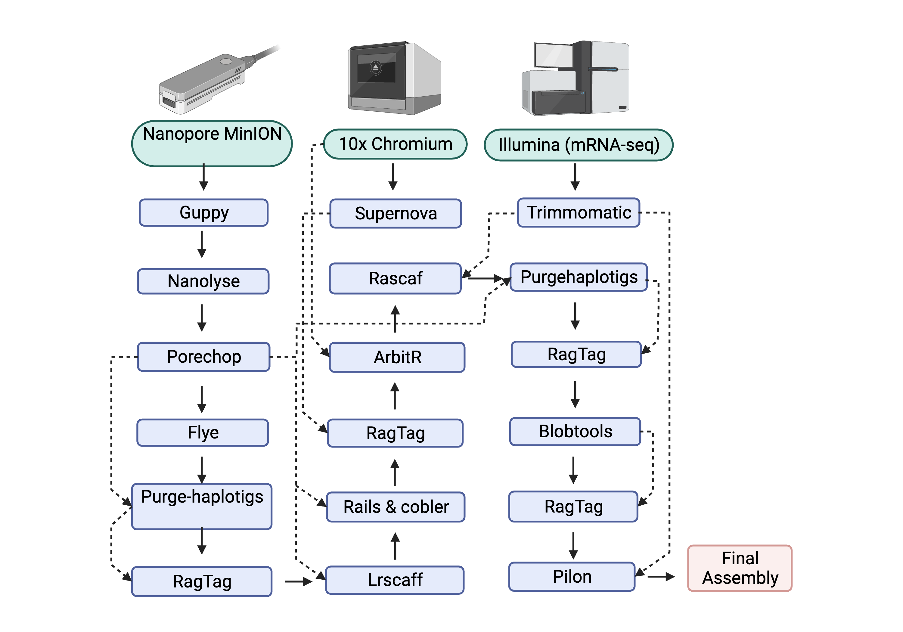

## Lucerne weevil-assembly-pipeline
Sitona discoidus whole genome assembly pipeline
## Sequencing of lucerne weevil
 We sequenced 4 individual adult lucerne weevils using Nanopore MinION flow cells which in total gave us coverage over > 30 times the genome of this weevil. Similarly, we  also sequenced the weevil using linked read technology (10X Chromium) which was >60X the coverage of the estimated genome of this weevil.The schematic represantation of the genome assembly pipeline is given below.
 


 
### Long read genome assembly of this weevil 
We got an output yield of raw data 9.38 Gb, 6.21 Gb, 3.77 Gb and 10.6 Gb from ist. second, 3rd and 4th run respectively. We combined the total output from these 4 minion runs in total and conducted basecalling. ALL THE raw `fast5` files were base called using `guppy`. The script for 'Guppy' is given below.

 `Script for Guppy version 5`
 
 ```
 #!/bin/bash -e

#SBATCH --job-name=guppy_lw                #name of the job
#SBATCH --account=uoo02772              #my project number in nesi
#SBATCH --time=40:00:00                 #wall time
#SBATCH --partition=gpu                 #guppy runs faster in gpu partition in nesi
#SBATCH --gres=gpu:1                    #some configuration for gpu partition
#SBATCH --mem=6G                         #memory 6gb
#SBATCH --ntasks=6                       #ntask set to 4
#SBATCH --cpus-per-task=1               #cpu per task set to 1
#SBATCH --output=%x-%j.out              #%x gives job name and %j gives job number, this is slurm output file
#SBATCH --error=%x-%j.err               #similar slurm error file
#SBATCH --mail-type=ALL
#SBATCH --mail-user=katma889@student.otago.ac.nz

module load ont-guppy-gpu/5.0.7
guppy_basecaller -i ../ -s . --flowcell FLO-MIN106 --kit SQK-LSK109 --num_callers 6 -x auto --recursive --trim_barcodes --disable_qscore_filtering

```
Then after we ran `pycoQC` on base called fastq files obatined from `guppy` for every minion runs.

`Script for PycoQC`

```
#!/bin/bash -e

#SBATCH --nodes 1
#SBATCH --cpus-per-task 1
#SBATCH --ntasks 10
#SBATCH --partition=large
#SBATCH --job-name pycoqc
#SBATCH --mem=50G
#SBATCH --time=01:00:00
#SBATCH --account=uoo02772
#SBATCH --output=%x.%j.out
#SBATCH --error=%x.%j.err
#SBATCH --mail-type=ALL
#SBATCH --mail-user=katma889@student.otago.ac.nz
#SBATCH --hint=nomultithread

export PATH="/path/to/miniconda3/bin:$PATH"

pycoQC -f ../sequencing_summary.txt -o pycoQC_output.html

```
The output for pycoqc runs are given in the table below
Pycoqc report for minion runs

`Pycoqc report for 4 minion runs`

```
Minion Runs	 Reads	       Bases (Gb)	  Median Read Length	  Median PHRED score
1	          3,907,351	     9.37	         838	                13.6
2	          768,000	       6.41	        2410	                12.4
3	          673,176	       4.02	        3480	                12.5
4	          2,210,541	     10.6	        1300	                13.4

```
Then we ran 'NanoLyse' in the guppy basecalled fast files to remove lama DNA CS (control) from our fastq file.

`Script for NanoLyse`

```
#!/bin/bash -e

#SBATCH --nodes 1
#SBATCH --cpus-per-task 1
#SBATCH --ntasks 10
#SBATCH --partition=large
#SBATCH --job-name nanolyse.job
#SBATCH --mem=50G
#SBATCH --time=08:00:00
#SBATCH --account=uoo02772
#SBATCH --output=%x.%j.out
#SBATCH --error=%x.%j.err
#SBATCH --mail-type=ALL
#SBATCH --mail-user=katma889@student.otago.ac.nz
#SBATCH --hint=nomultithread

export PATH="/nesi/nobackup/uoo02752/nematode/bin/miniconda3/bin:$PATH"

cat ../lw.ont.all.merged.fastq | NanoLyse --reference ./dna_cs.fasta | gzip > lw_ont_filtered.fastq.gz

```
The above run gave us filleted reads named `lw_ont_filtered.fastq.gz`.Then the filtered reads were further processed to `Porechop` to find and remove the adapters from filetred nanopore reads

`Script for Porechop`

```
#!/bin/bash -e

#SBATCH --nodes 1
#SBATCH --cpus-per-task 1
#SBATCH --ntasks 10
#SBATCH --partition=bigmem
#SBATCH --job-name porechop
#SBATCH --mem=100G
#SBATCH --time=72:00:00
#SBATCH --account=uoo02772
#SBATCH --output=%x.%j.out
#SBATCH --error=%x.%j.err
#SBATCH --mail-type=ALL
#SBATCH --mail-user=bhaup057@student.otago.ac.nz
#SBATCH --hint=nomultithread

module load Porechop/0.2.4-gimkl-2020a-Python-3.8.2
porechop -i ../lw_ont_filtered.fastq.gz -o lw_ont_nanolyse_porechop.fastq.gz --threads 10

```
Then we run Flye (2.8.3) assembler to `lw_ont_nanolyse_porechop.fastq.gz` which gave us result under flye folder with different files. we used the assmly from 'Flye' as our primary assembly and used 'Supernova' assembly from 10x linked reads for scafolding and gap closing process. Likewise, we use the Illumina mRNA transcriptomic data for scafolding and ploshing the genome to obtain a good quality hybrid genome for this pernicious weevil.

`Script for Flye`

```
#!/bin/bash -e

#SBATCH --nodes 1
#SBATCH --cpus-per-task 1
#SBATCH --ntasks 16
#SBATCH --partition=hugemem
#SBATCH --job-name flye.lw
#SBATCH --mem=200G
#SBATCH --time=72:00:00
#SBATCH --account=uoo02772
#SBATCH --output=%x_%j.out
#SBATCH --error=%x_%j.err
#SBATCH --mail-type=ALL
#SBATCH --mail-user=bhaup057@student.otago.ac.nz
#SBATCH --hint=nomultithread

module load Flye/2.8.3-gimkl-2020a-Python-3.8.2

flye --nano-raw ../lw_ont_nanolyse_porechop.fastq.gz -o ./flye -t 16 -i 3 --resume

```
Thenafter we ran `Purge-haplotigs` to identify and remove both haplotigs and heterozygous overlaps on `assembly.fasta` files produced by `flye` assembler

`Script for Purge-haplotigs`

```
#!/bin/bash -e

#SBATCH --nodes 1
#SBATCH --cpus-per-task 1
#SBATCH --ntasks 10
#SBATCH --partition=large
#SBATCH --job-name purge_lw
#SBATCH --mem=50G
#SBATCH --time=10:00:00
#SBATCH --account=uoo02772
#SBATCH --output=%x_%j.out
#SBATCH --error=%x_%j.err
#SBATCH --mail-type=ALL
#SBATCH --mail-user=katma889@student.otago.ac.nz
#SBATCH --hint=nomultithread

module load SAMtools/1.12-GCC-9.2.0
module load minimap2/2.20-GCC-9.2.0
module load BEDTools/2.29.2-GCC-9.2.0

export PATH="/nesi/nobackup/uoo02772/bin/miniconda3/envs/purge_haplotigs_env/bin:$PATH"

# Run below steps sequentially
# Step 1
minimap2 -t 10 -ax map-ont assembly.fasta lw_ont_nanolyse_porechop.fastq.gz \
--secondary=no | samtools sort -m 5G -o aligned.bam -T tmp.ali

# Step 2
purge_haplotigs  hist  -b aligned.bam  -g assembly.fasta -t 10

# Step 3
purge_haplotigs cov -i aligned.bam.gencov -l 2 -m 25 -h 190 -o coverage_stats.csv

# Step 4
awk '{print $1",s,"}' assembly.fasta.fai >cov_stat.csv

# Step 5
purge_haplotigs purge -g assembly.fasta -c coverage_stats.csv -b aligned.bam -dotplots

```
This above script gave us the histo file to see the quality and our main output file `curated.fasta` which were further processed to run QUAST.

`Script for QUAST`

```
#!/bin/bash -e

#SBATCH --nodes 1
#SBATCH --cpus-per-task 1
#SBATCH --ntasks 10
#SBATCH --partition=large
#SBATCH --job-name quast_lw1
#SBATCH --mem=10G
#SBATCH --time=05:00:00
#SBATCH --account=uoo02772
#SBATCH --output=%x_%j.out
#SBATCH --error=%x_%j.err
#SBATCH --mail-type=ALL
#SBATCH --mail-user=katma889@student.otago.ac.nz
#SBATCH --hint=nomultithread

module load QUAST
quast.py -t 10 --eukaryote --large --conserved-genes-finding \
curated.fasta \
-o quast
```
Then we ran `LRscaff` where we scaffold the contains from purge haplotigs as `curated fasta` to our filtered and trimmed raw data that is `lw_ont_nanolyse_porechop.fastq.gz` for five times using the script below:

`Script for LRscaff`

```
#!/bin/bash -e

#SBATCH --nodes 1
#SBATCH --cpus-per-task 1
#SBATCH --ntasks 10
#SBATCH --partition=large
#SBATCH --job-name lrscaf
#SBATCH --mem=50G
#SBATCH --time=72:00:00
#SBATCH --account=uoo02752
#SBATCH --output=%x_%j.out
#SBATCH --error=%x_%j.err
#SBATCH --mail-type=ALL
#SBATCH --mail-user=bhaup057@student.otago.ac.nz
#SBATCH --hint=nomultithread

module load minimap2

# map long reads to the assembly and use lrscaff to scaffold it

# Step 1
minimap2 -t 10 curated.fasta lw_ont_nanolyse_porechop.fastq.gz > ./aln.mm

# Step 2
export PATH="/nesi/nobackup/uoo02752/bin/lrscaf/target/:$PATH"

java -Xms40g -Xmx40g -jar /nesi/nobackup/uoo02752/bin/lrscaf/target/LRScaf-1.1.11.jar --contig curated.fasta --alignedFile aln.mm -t mm -p 10 --output ./scaffolds1

```
Then we ran `QUAST` on all 5 output produced by the LRscaff

`Script for QUAST`

```
#!/bin/bash -e

#SBATCH --nodes 1
#SBATCH --cpus-per-task 1
#SBATCH --ntasks 10
#SBATCH --partition=large
#SBATCH --job-name quast_lw1
#SBATCH --mem=10G
#SBATCH --time=10:00:00
#SBATCH --account=uoo02772
#SBATCH --output=%x_%j.out
#SBATCH --error=%x_%j.err
#SBATCH --mail-type=ALL
#SBATCH --mail-user=katma889@student.otago.ac.nz
#SBATCH --hint=nomultithread

module load QUAST
quast.py -t 10 --eukaryote --large --conserved-genes-finding \
/path/to/assembly.fasta \
/path/to/another.assembly.fasta \
-o quast

```
Then we used `LR_Gapcloser` for gap closing using the output `scaffold.fasta` obatined from `LRscaff` and ONT filtered and trimmed raw reads.

`Script for LR_Gapcloser`

```
#!/bin/bash -e

#SBATCH --nodes 1
#SBATCH --cpus-per-task 1
#SBATCH --ntasks 10
#SBATCH --partition=large
#SBATCH --job-name lr-gaplw
#SBATCH --mem=20G
#SBATCH --time=72:00:00
#SBATCH --account=uoo02772
#SBATCH --output=%x_%j.out
#SBATCH --error=%x_%j.err
#SBATCH --mail-type=ALL
#SBATCH --mail-user=katma889@student.otago.ac.nz
#SBATCH --hint=nomultithread

module load BWA/0.7.17-GCC-9.2.0
export PATH=/nesi/nobackup/uoo02772/bin/LR_Gapcloser/src:$PATH

sh LR_Gapcloser.sh -i scaffolds.fasta -l lw_ont_nanolyse_porechop.fastq.gz -s n -t 10 -r 15

```        
Then we ran 

`Script for rails.cobler`

```
#!/bin/bash -e

#SBATCH --nodes 1
#SBATCH --cpus-per-task 1
#SBATCH --ntasks 10
#SBATCH --job-name rails.lw.2
#SBATCH --mem=90G
#SBATCH --time=72:00:00
#SBATCH --account=uoo02752
#SBATCH --output=%x_%j.out
#SBATCH --error=%x_%j.err
#SBATCH --mail-type=ALL
#SBATCH --mail-user=bhaup057@student.otago.ac.nz
#SBATCH --hint=nomultithread

module load Perl/5.30.1-GCC-9.2.0
module load minimap2
module load SAMtools/1.13-GCC-9.2.0
export PATH="/nesi/nobackup/uoo02772/path/to/RAILS/bin:$PATH"

sh runRAILSminimapSTREAM.sh scaffold.fasta lw_ont_nanolyse_porechop.fasta 250 0.80 500 2 ont \
/scale_wlg_persistent/filesets/opt_nesi/CS400_centos7_bdw/SAMtools/1.13-GCC-9.2.0/bin/samtools 10

```
We ran the `Quast' on the output of the above script.

Then we ran `RagTag` 

`Script for RagTag`

```
#!/bin/bash -e

#SBATCH --nodes 1
#SBATCH --cpus-per-task 1
#SBATCH --ntasks 10
#SBATCH --job-name ragtag.lw
#SBATCH --mem=50G
#SBATCH --time=28:00:00
#SBATCH --account=uoo02772
#SBATCH --output=%x_%j.out
#SBATCH --error=%x_%j.err
#SBATCH --mail-type=ALL
#SBATCH --mail-user=katma889@student.otago.ac.nz
#SBATCH --hint=nomultithread

export PATH="/nesi/nobackup/uoo02752/nematode/bin/miniconda3/bin:$PATH"

ragtag.py scaffold lw_10xSN.fasta lw_ont_assembly.fasta

```

`Run Quast as above`. Then we used `minimap2` 

`Script for minimap2`

```
#!/bin/bash -e

#SBATCH --nodes 1
#SBATCH --cpus-per-task 1
#SBATCH --ntasks 10
#SBATCH --job-name ragtag.patch.lw
#SBATCH --mem=30G
#SBATCH --time=20:00:00
#SBATCH --account=uoo02772
#SBATCH --output=%x_%j.out
#SBATCH --error=%x_%j.err
#SBATCH --mail-type=ALL
#SBATCH --mail-user=katma889@student.otago.ac.nz
#SBATCH --hint=nomultithread

module load minimap2/2.20-GCC-9.2.0
export PATH="/nesi/nobackup/uoo02752/nematode/bin/miniconda3/bin:$PATH"

ragtag.py patch lw.assembly.fasta lw_10xSN.fasta \
-t 10 --aligner /scale_wlg_persistent/filesets/opt_nesi/CS400_centos7_bdw/minimap2/2.20-GCC-9.2.0/bin/minimap2

```
Then we ran Quast on the output.

Then we ran `arbitr`

`Script for arbitr`

```
#!/bin/bash -e
#SBATCH --nodes 1
#SBATCH --cpus-per-task 1
#SBATCH --ntasks 10
#SBATCH --job-name arbitr.lw
#SBATCH --mem=5G
#SBATCH --time=05:00:00
#SBATCH --account=uoo02772
#SBATCH --output=%x_%j.out
#SBATCH --error=%x_%j.err
#SBATCH --mail-type=ALL
#SBATCH --mail-user=katma889@student.otago.ac.nz
#SBATCH --hint=nomultithread

export PATH="/nesi/nobackup/uoo02752/nematode/bin/ARBitR/src:$PATH"
export PATH="/nesi/nobackup/uoo02752/nematode/bin/miniconda3/bin:$PATH"

arbitr.py -i ../ragtag.scaffold.fasta -o output.arbitr.scaffolds longranger_align/LW/outs/possorted_bam.bam
```
Then we ran `rascaf` using mRNA-seq data for this weevil that gives us output in a folder `alignment`

`Script for hisat2`

```
#!/bin/bash -e
#SBATCH --job-name=hisat.mRNA.LW
#SBATCH --account=uoo02772
#SBATCH --nodes 1 
#SBATCH --cpus-per-task 1 
#SBATCH --ntasks 20
#SBATCH --mem=40G
#SBATCH --time=20:00:00
#SBATCH --output=%x.%j.out
#SBATCH --error=%x.%j.err
#SBATCH --mail-type=All
#SBATCH --mail-user=katma889@student.otago.ac.nz
#SBATCH --hint=nomultithread

module load HISAT2/2.2.1-gimkl-2020a
module load Python/3.9.5-gimkl-2020a
module load SAMtools/1.13-GCC-9.2.0

hisat2-build -p 20 output.arbitr.scaffolds.fasta hisat2.RNA.LW

mkdir alignment

hisat2 -x hisat2.RNA.LW -1 ./RNA_seq_LW_merged.R1.fastq -2 ./RNA_seq_LW_merged.R2.fastq -S alignment/LW_mRNA_alignment.sam
samtools view -bS alignment/LW_mRNA_alignment.sam > alignment/LW_mRNA_alignment.bam
samtools sort alignment/LW_mRNA_alignment.bam -o alignment/LW_mRNA_alignment_sorted.bam

```
Then we ran `rascaf`

`Script for rascaf`

```
#!/bin/bash -e

#SBATCH --job-name=rascaf.LW.mrna
#SBATCH --account=uoo02772
#SBATCH --nodes 1
#SBATCH --cpus-per-task 1
#SBATCH --ntasks 10
#SBATCH --mem=5G
#SBATCH --time=04:00:00
#SBATCH --output=%x.%j.out
#SBATCH --error=%x.%j.err
#SBATCH --mail-type=All
#SBATCH --mail-user=bhaup057@student.otago.ac.nz
#SBATCH --hint=nomultithread

export PATH=/nesi/nobackup/uoo02752/nematode/bin/rascaf:$PATH

rascaf -b alignment/LW_mRNA_alignment_sorted.bam \
        -f output.arbitr.scaffolds.fasta \
        -o LW_mRNA_scaffold

rascaf-join -r LW_mRNA_scaffold.out -o LW_mRNA_scaffold

```
Then we ran 'purgehaplotigs' to remove redundandant and chimeric reads.

`Script for purgehaplotigs`

```
#!/bin/bash -e

#SBATCH --nodes 1
#SBATCH --cpus-per-task 1
#SBATCH --ntasks 10
#SBATCH --job-name purgehap.lw
#SBATCH --mem=50G
#SBATCH --time=08:00:00
#SBATCH --account=uoo02772
#SBATCH --output=%x_%j.out
#SBATCH --error=%x_%j.err
#SBATCH --mail-type=ALL
#SBATCH --mail-user=katma889@student.otago.ac.nz
#SBATCH --hint=nomultithread

module load SAMtools/1.13-GCC-9.2.0
module load minimap2/2.20-GCC-9.2.0
module load BEDTools/2.29.2-GCC-9.2.0

# Step 1
minimap2 -t 16 -ax map-ont LW_mRNA_scaffold.fa lw_ont_nanolyse_porechop.fa \
--secondary=no | samtools sort -m 5G -o aligned.bam -T tmp.ali

# Step 2
export PATH="/nesi/nobackup/uoo02752/.conda/envs/purge_haplotigs_env/bin:$PATH"
purge_haplotigs hist -b aligned.bam -g LW_mRNA_scaffold.fa -t 10

# Step 3
purge_haplotigs cov -i aligned.bam.gencov -l 0 -m 35 -h 190 -o coverage_stats.csv

# Step 4
purge_haplotigs purge -g LW_mRNA_scaffold.fa -c coverage_stats.csv -b aligned.bam

```
Then we ran `RagTag` for scaffolding the curated genome using discarded haplotigs reads from purgehaplotigs.

`Script for RagTag`

```
#!/bin/bash -e

#SBATCH --nodes 1
#SBATCH --cpus-per-task 1
#SBATCH --ntasks 10
#SBATCH --job-name ragtag.lw
#SBATCH --mem=30G
#SBATCH --time=01:00:00
#SBATCH --account=uoo02772
#SBATCH --output=%x_%j.out
#SBATCH --error=%x_%j.err
#SBATCH --mail-type=ALL
#SBATCH --mail-user=katma889@student.otago.ac.nz
#SBATCH --hint=nomultithread

export PATH="/nesi/nobackup/uoo02752/nematode/bin/miniconda3/bin:$PATH"

ragtag.py scaffold ../curated.haplotigs.fasta ragtag.scaffold.renamed.fasta

```
Then we ran `Blobtools2` 

`Script for Blobtools`

```
# Step 1
/nesi/nobackup/uoo02752/earwig/bin/blobtoolkit/blobtools2/blobtools create \
--fasta ../LW_Assembly.fasta \
--meta ../LW_Assembly.yaml \
--taxid 430899 \
--taxdump /nesi/nobackup/uoo02772/crw/2.nanopore/1.CRW_nanopore_rawdata/guppy.5/nanolyse/porechop/nanoqc/nanofilt/flye/Flye/purgehaplotigs/ragtag_output/lrscaff/scaffolds1/scaffolds2/scaffolds3/scaffolds4/scaffolds5/rails.cobbler/lrgapcloser/Output/sn.10x.ragtag/ragtag_output/ragtag.2/ragtag_output/arbitr/arks/rascaf/alignment/rascaf/purge_haplotigs/ragtag/ragtag_output/ragtag2/ragtag_output/blobtools/taxdump/ \
LW_Assembly

# Step 2
/nesi/nobackup/uoo02752/earwig/bin/blobtoolkit/blobtools2/blobtools add \
 --hits ../blastn/results/blastn.out \
 --hits ../diamondx/results/output.blastx.all \
 --cov ../coverage/LW_Assembly.bam \
 --taxrule bestsumorder \
 --taxdump /nesi/nobackup/uoo02772/crw/2.nanopore/1.CRW_nanopore_rawdata/guppy.5/nanolyse/porechop/nanoqc/nanofilt/flye/Flye/purgehaplotigs/ragtag_output/lrscaff/scaffolds1/scaffolds2/scaffolds3/scaffolds4/scaffolds5/rails.cobbler/lrgapcloser/Output/sn.10x.ragtag/ragtag_output/ragtag.2/ragtag_output/arbitr/arks/rascaf/alignment/rascaf/purge_haplotigs/ragtag/ragtag_output/ragtag2/ragtag_output/blobtools/taxdump/ \
LW_Assembly

# Step 3
/nesi/nobackup/uoo02752/earwig/bin/blobtoolkit/blobtools2/blobtools filter \
--param bestsumorder_superkingdom--Keys=Bacteria \
--param bestsumorder_superkingdom--Keys=Viruses \
--param LW_Assembly_cov--Min=5 \
--param length--Min=1000 \
--fasta ../LW_assembly.fasta \
--output ./filtered.bacteria.viruses.minl1000.covmin5 \
LW_Assembly

# Step 4
/nesi/nobackup/uoo02752/earwig/bin/blobtoolkit/blobtools2/blobtools filter \
--param LW_Assembly_cov--Min=5 \
--param length--Min=1000 \
--fasta ../LW_assembly.fasta \
--invert \
--output ./filter.mincov5.minlen1000.invert \
LW_Assembly

```
Then we ran `RagTag` to scaffold the filtered genome with the low coverage discarded reads from the above step.

`Script for RagTag`

```
#!/bin/bash -e

#SBATCH --nodes 1
#SBATCH --cpus-per-task 1
#SBATCH --ntasks 10
#SBATCH --job-name ragtag.lw
#SBATCH --mem=30G
#SBATCH --time=01:00:00
#SBATCH --account=uoo02772
#SBATCH --output=%x_%j.out
#SBATCH --error=%x_%j.err
#SBATCH --mail-type=ALL
#SBATCH --mail-user=katma889@student.otago.ac.nz
#SBATCH --hint=nomultithread

export PATH="/nesi/nobackup/uoo02752/nematode/bin/miniconda3/bin:$PATH"

ragtag.py scaffold LW_Assembly.filtered.invert.fasta LW_Assembly.filtered.fasta

```
Then we ran `Pilon` for polishing the genome using filtered RNA-seq reads.

`Script for Pilon`

```
#!/bin/bash -e

#SBATCH --nodes 1
#SBATCH --cpus-per-task 1
#SBATCH --ntasks 16
#SBATCH --job-name pilon_LW
#SBATCH --mem=200G
#SBATCH --time=3-00:00:00
#SBATCH --account=uoo02772
#SBATCH --output=%x_%j.out
#SBATCH --error=%x_%j.err
#SBATCH --mail-type=ALL
#SBATCH --mail-user=katma889@student.otago.ac.nz
#SBATCH --hint=nomultithread

module load Bowtie2/2.4.1-GCC-9.2.0
module load SAMtools/1.12-GCC-9.2.0
module load Python/3.9.5-gimkl-2020a
module load Pilon/1.24-Java-15.0.2

bowtie2-build LW_assembly.fasta weevil
bowtie2 -p 16 --local -x weevil -1 RNA_seq_LW_merged.R1.fastq -2 RNA_seq_LW_merged.R2.fastq | samtools sort > LW_assembly.fasta.bam
samtools index LW_assembly.fasta.bam LW_assembly.fasta.bai

##To run Pilon
java -Xmx200G -jar $EBROOTPILON/pilon.jar --genome LW_assembly.fasta --frags LW_assembly.fasta.bam --fix snps,indels --output LW_assembly.pilon \
--gapmargin 1 --mingap 10000000 --threads 10 --verbose --changes 2>Pilon.stderr.txt 1>Pilon.stdout.txt

```

# Repeat annotation
Refer to scripts [here](https://github.com/upendrabhattarai/Earwig_genome_project?tab=readme-ov-file#2-denovo-repeat-library) for repeat annotation.

# Annotation pipeline
Please refer to scripts [here](https://github.com/upendrabhattarai/Earwig_genome_project?tab=readme-ov-file#3-genome-annotation) for our annotation pipeline.
